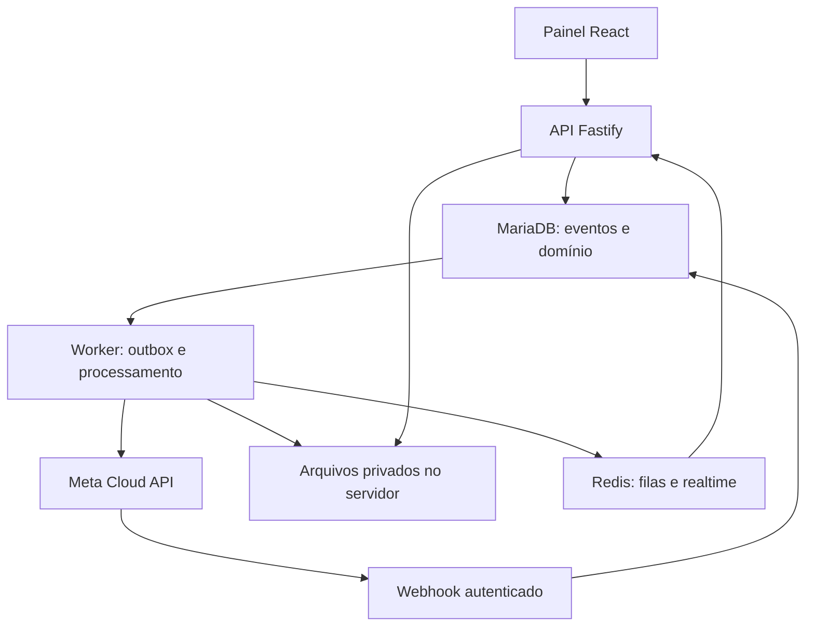

# WappHub Chat

Central de atendimento WhatsApp com múltiplos atendentes, transferência com controle de histórico, gestão da integração oficial e acompanhamento de consumo.

**Repositório oficial:** https://github.com/uillaneduardo/chat

**Destino de hospedagem:** `https://chat.wapphub.com.br` no homelab.

> **Versão 0.1.1 — beta utilizável para piloto.** Código executável com atendimento demo persistido, transferência de histórico, arquivos internos e adapter de texto Meta. A integração externa exige configuração e validação com sua conta; o MVP completo continua em desenvolvimento. Veja a [matriz de funcionalidades](docs/15-feature-status.md).

## Funcionalidades da beta

- Login, usuários por empresa, contatos, inbox e notas internas.
- Transferência com histórico completo, recorte ou somente mensagens futuras; ACL aplicada a mensagens e arquivos.
- Conta demo sem envio externo e integração Meta para texto, webhook assinado e templates sem parâmetros.
- Arquivos internos até 2 GiB, streaming, upload em chunks de 8 MiB, quotas, downloads e links revogáveis.
- Cadastro de tarifas manuais, consumo estimado e trilha de auditoria.

**Ainda pendentes:** filas/departamentos/tags, mídia nativa Meta, MFA/reset de senha, realtime por socket, retenção/dedup, orçamento com bloqueio e conciliação oficial. Scanner é opcional e não está incluído na imagem padrão; sem ele arquivos ficam em quarentena por padrão.

## Direção do produto (escopo completo)

- Inbox compartilhada: conversas, filas, atribuição, tags, notas internas e encerramento.
- Transferência manual para outro atendente, com histórico completo, recorte ou somente mensagens futuras.
- Novo contexto sem apagar registros: gestores autorizados preservam a visão administrativa.
- Gestão de contas, números, templates, credenciais, webhooks e diagnóstico da Cloud API da Meta.
- Consumo por empresa, número, categoria e período, com tarifas versionadas, orçamento e conciliação.
- Arquivos no servidor, streaming, upload retomável, quotas, retenção e links externos revogáveis.
- Isolamento por empresa e autorização aplicada a APIs, anexos, pesquisa, exportações e eventos em tempo real.

## Arquitetura proposta

Monorepo TypeScript; React/Vite, Node.js/Fastify e Prisma/MariaDB. Nesta beta, o worker é executado no mesmo processo da API e usa fila durável no banco, com polling na UI. Uma instância por instalação. Redis/worker independente e storage S3 ficam para evolução. Versões exatas e lockfile presentes. Ver [ADR 0004](docs/adr/0004-pilot-beta.md).



## Navegação da documentação

| Documento | Conteúdo |
|---|---|
| [Instalação](docs/14-installation.md) | Executar no homelab e configurar Meta |
| [Status das funcionalidades](docs/15-feature-status.md) | Implementado, parcial e pendente |
| [Escopo](docs/01-product.md) | MVP, jornadas e limites |
| [Arquitetura](docs/02-architecture.md) | Módulos, confiabilidade e runtime |
| [Domínio](docs/03-domain.md) | Entidades e invariantes de dados |
| [Histórico e transferência](docs/04-history-access.md) | Sessões, recortes e autorização |
| [Integração WhatsApp](docs/05-whatsapp.md) | Contas, templates, webhooks e diagnóstico |
| [Consumo e custos](docs/06-usage-pricing.md) | Estimativa, tarifas e conciliação |
| [Arquivos](docs/07-storage.md) | Streaming, chunks, quotas e compartilhamento |
| [Segurança e auditoria](docs/08-security-audit.md) | Ameaças, controles e rastreabilidade |
| [Contrato de API](docs/09-api.md) | Rotas propostas e convenções |
| [Operação no homelab](docs/10-operations.md) | Implantação, backup e restauração |
| [Qualidade](docs/11-quality.md) | Testes e critérios de aceite |
| [Roadmap](docs/12-roadmap.md) | Incrementos e dependências |
| [Fontes e pendências](docs/13-sources.md) | Referências oficiais e validações |
| [Decisões](docs/adr/README.md) | Registro de arquitetura |

## Estrutura

```text
apps/web/           Interface de atendimento e administração
apps/api/           API, autorização e ingresso de webhooks
apps/worker/        Filas, mídia, outbox e consumo
packages/domain/    Regras de negócio independentes de framework
packages/contracts/ DTOs, validação e contratos de API/eventos
packages/database/  Prisma, migrações e seeds sintéticos futuros
packages/config/    Configuração validada e limites
infra/              Implantação e operação futuras
scripts/            Verificações da fundação documental
tests/             Plano de testes e fixtures sintéticas
docs/              Especificação e decisões
```

## Começar

Siga o [passo a passo de instalação](docs/14-installation.md). Não há usuário/senha padrão: o proprietário é criado pelo bootstrap. Exemplo após preencher `.env` e preparar MariaDB:

```bash
npm ci
npm run db:generate
npm run db:migrate
npm run bootstrap
npm run build
npm start
```

Docker Compose também está disponível. Banco e arquivos são persistentes; não há deploy automático no seu homelab.

## Verificação

```bash
python3 scripts/check_repository.py
npm run build
npm test
npm audit
```

Sem TEST_DATABASE_URL, teste de integração é explicitamente ignorado. Com banco dedicado terminado em `_test` e migration aplicada, os testes exercitam a API com MariaDB real; apagam dados desse banco de teste. Nunca aponte para banco de clientes. Consulte [Qualidade](docs/11-quality.md) para resultados e limites.

## Custos e histórico

Nenhuma tarifa real está embutida no scaffold. Um webhook de entrega não equivale a uma fatura e pode não fornecer valor monetário. Estimativas precisam de tabela oficial aplicável e evidências; valores confirmados exigem conciliação. Transferir sem histórico altera a autorização do atendente, não o histórico do cliente no WhatsApp.

## Licença

A licença de distribuição ainda será definida pelo mantenedor; este repositório não concede uma licença de uso específica nesta etapa.
