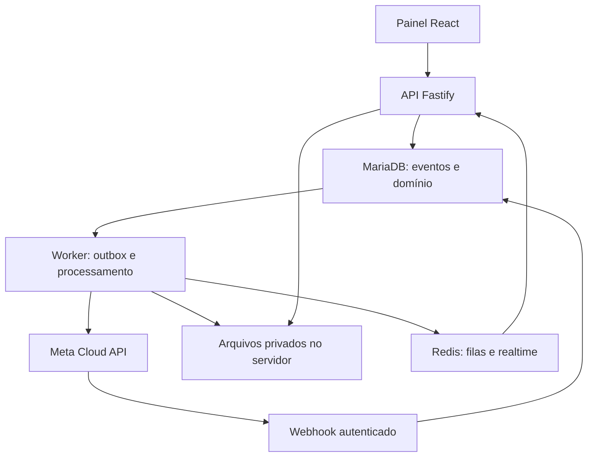

# WappHub Chat

Central de atendimento WhatsApp com múltiplos atendentes, transferência com controle de histórico, gestão da integração oficial e acompanhamento de consumo.

**Repositório oficial:** https://github.com/uillaneduardo/chat  
**Destino de hospedagem:** `https://chat.wapphub.com.br` no homelab.

> Status: fundação documental e estrutura de desenvolvimento. Não há aplicativo executável, integração ativa, migrações ou controles de segurança implementados nesta versão. Os recursos abaixo são requisitos planejados.

## O que o projeto pretende oferecer

- Inbox compartilhada: conversas, filas, atribuição, tags, notas internas e encerramento.
- Transferência manual para outro atendente, com histórico completo, recorte ou somente mensagens futuras.
- Novo contexto sem apagar registros: gestores autorizados preservam a visão administrativa.
- Gestão de contas, números, templates, credenciais, webhooks e diagnóstico da Cloud API da Meta.
- Consumo por empresa, número, categoria e período, com tarifas versionadas, orçamento e conciliação.
- Arquivos no servidor, streaming, upload retomável, quotas, retenção e links externos revogáveis.
- Isolamento por empresa e autorização aplicada a APIs, anexos, pesquisa, exportações e eventos em tempo real.

## Arquitetura proposta

Monorepo TypeScript; React/Vite no frontend, Node.js/Fastify na API, worker separado, MariaDB/Prisma e Redis para filas. Filesystem local inicialmente; interface de storage preparada para S3/MinIO. Docker Compose e Cloudflare Tunnel na implantação futura. Versões e lockfile serão fixados no primeiro incremento executável; Bun não será um segundo runtime obrigatório.



## Navegação da documentação

| Documento | Conteúdo |
|---|---|
| [Escopo](docs/01-product.md) | MVP, jornadas e limites |
| [Arquitetura](docs/02-architecture.md) | Módulos, confiabilidade e runtime |
| [Domínio](docs/03-domain.md) | Entidades e invariantes de dados |
| [Histórico e transferência](docs/04-history-access.md) | Sessões, recortes e autorização |
| [Integração WhatsApp](docs/05-whatsapp.md) | Contas, templates, webhooks e diagnóstico |
| [Consumo e custos](docs/06-usage-pricing.md) | Estimativa, tarifas e conciliação |
| [Arquivos](docs/07-storage.md) | Streaming, chunks, quotas e compartilhamento |
| [Segurança e auditoria](docs/08-security-audit.md) | Ameaças, controles e rastreabilidade |
| [Contrato de API](docs/09-api.md) | Rotas propostas e convenções |
| [Operação no homelab](docs/10-operations.md) | Implantação, backup e restauração |
| [Qualidade](docs/11-quality.md) | Testes e critérios de aceite |
| [Roadmap](docs/12-roadmap.md) | Incrementos e dependências |
| [Fontes e pendências](docs/13-sources.md) | Referências oficiais e validações |
| [Decisões](docs/adr/README.md) | Registro de arquitetura |

## Estrutura

```text
apps/web/           Interface de atendimento e administração
apps/api/           API, autorização e ingresso de webhooks
apps/worker/        Filas, mídia, outbox e consumo
packages/domain/    Regras de negócio independentes de framework
packages/contracts/ DTOs, validação e contratos de API/eventos
packages/database/  Prisma, migrações e seeds sintéticos futuros
packages/config/    Configuração validada e limites
infra/              Implantação e operação futuras
scripts/            Verificações da fundação documental
 tests/             Plano de testes e fixtures sintéticas
 docs/              Especificação e decisões
```

## Verificar esta versão

Requisito: Python 3.11 ou superior, sem dependências externas.

```bash
python3 scripts/check_repository.py
```

O comando verifica links locais, arquivos obrigatórios, JSON, segredos comuns e formato básico da configuração. A CI executa o mesmo verificador. Isso não substitui testes da aplicação ou auditoria de segurança.

Não execute `npm install` ou `docker compose up` nesta etapa: manifests de aplicação e containers serão entregues no marco M1. Veja [Contribuição](CONTRIBUTING.md), [Segurança](SECURITY.md) e [Changelog](CHANGELOG.md).

## Custos e histórico

Nenhuma tarifa real está embutida no scaffold. Um webhook de entrega não equivale a uma fatura e pode não fornecer valor monetário. Estimativas precisam de tabela oficial aplicável e evidências; valores confirmados exigem conciliação. Transferir sem histórico altera a autorização do atendente, não o histórico do cliente no WhatsApp.

## Licença

A licença de distribuição ainda será definida pelo mantenedor; este repositório não concede uma licença de uso específica nesta etapa.
